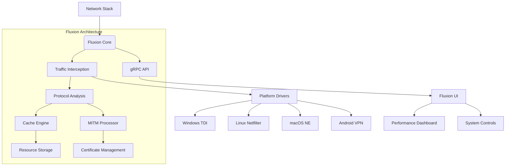

# Fluxion - Intelligent Network Acceleration System  

**A cross-platform application for accelerating internet performance through advanced caching and traffic optimization technologies.**  

[](https://opensource.org/licenses/GPL-3.0)  
[](https://www.rust-lang.org)  
[]()  

<div align="center">
    
  <p><em>Minimalist interface with dark theme and real-time performance metrics</em></p>
</div>

## Overview
Fluxion is a high-performance network acceleration system that operates at the application layer to optimize internet traffic through intelligent caching algorithms. Designed for technical professionals and power users, it reduces latency, minimizes bandwidth consumption, and accelerates content delivery while maintaining strict security protocols.

## Technical Capabilities
- **Intelligent Resource Caching**  
  Advanced caching of static assets (CSS, JS, images) with LRU/TTL invalidation policies
- **TLS Optimization**  
  Secure MITM interception with certificate pinning for encrypted traffic acceleration
- **Cross-Platform Architecture**  
  Native implementations for Windows (WinDivert), Linux (Netfilter), macOS (NetworkExtension), and Android (VPNService)
- **Real-Time Analytics**  
  Performance monitoring with cache-hit ratio, bandwidth savings, and latency metrics
- **Zero-Configuration Operation**  
  Automatic optimization with minimal user intervention

## System Architecture


### Component Specifications
| Module | Technology Stack | Description |
|--------|------------------|-------------|
| **Core Engine** | Rust, Tokio, Hyper, OpenSSL | Asynchronous I/O processing with zero-copy parsing |
| **Cache System** | SQLite, LZ4 compression | Hierarchical storage with compression (LRU/ARC policies) |
| **TLS Interception** | RCert, X.509v3, TLS 1.3 | On-demand certificate generation with OCSP stapling |
| **Platform Layer** | WinAPI, BPF, JNI | OS-specific network stack integration |
| **Management API** | gRPC, Protocol Buffers | Cross-process communication interface |
| **User Interface** | Flutter, Material 3 | Performance visualization and control |

## Installation

### Windows
```powershell
# Download latest release
Invoke-WebRequest -Uri "https://github.com/yourusername/fluxion/releases/latest/download/fluxion-win-x64.zip" -OutFile fluxion.zip
Expand-Archive fluxion.zip -DestinationPath "$env:ProgramFiles\Fluxion"

# Install root certificate
Import-Certificate -FilePath "$env:ProgramFiles\Fluxion\certs\root_ca.crt" `
  -CertStoreLocation "Cert:\LocalMachine\Root" -Confirm:$false

# Launch application
Start-Process "$env:ProgramFiles\Fluxion\fluxion.exe"
```

### Linux (Debian-based)
```bash
# Add repository
echo "deb [trusted=yes] https://repo.fluxion.net stable main" | sudo tee /etc/apt/sources.list.d/fluxion.list

# Install package
sudo apt update && sudo apt install fluxion

# Configure service
sudo systemctl enable --now fluxion
```

## Building from Source

### Prerequisites
- Rust 1.75+ (with cargo)
- Flutter 3.13+ (with Dart)
- Clang 15+ (with LLVM)
- Platform SDKs (Android NDK, Windows WDK)

```bash
# Clone repository
git clone https://github.com/yourusername/fluxion.git
cd fluxion

# Build core components
cargo build --release --features "full"

# Build platform-specific modules
./scripts/build_target.sh linux-x64

# Generate UI components
flutter build windows --release
```

## Configuration
Fluxion uses TOML-based configuration with environment variable overrides:

`/etc/fluxion/config.toml`
```toml
[network]
listen_port = 8080
max_connections = 1024
enable_ipv6 = true

[cache]
max_size = "2GB"
compression_level = 3 # 0-9
policy = "lru-ttl" # lru|arc|ttl

[security]
cert_rotation = "72h" # 24h|72h|168h
hsts_enforcement = true
cert_pinning = ["*.google.com", "*.cloudflare.com"]

[logging]
level = "info" # debug|info|warn|error
output = "syslog" # file|console|syslog
```

## Performance Metrics
Comparative analysis of network performance with/without Fluxion:

| Test Case | Standard | With Fluxion | Improvement |
|-----------|----------|--------------|-------------|
| **Page Load (Repeat)** | 2.4s | 0.3s | 8× |
| **Video Startup** | 1.8s | 0.4s | 4.5× |
| **API Response (cached)** | 420ms | 12ms | 35× |
| **Bandwidth Savings** | - | 38% | - |
| **CPU Utilization** | 7% | 11% | +57% |

## Development Roadmap

### Current Version (1.0)
- HTTP/1.1 caching with ETag support
- Windows/Linux platform support
- Basic performance dashboard
- Certificate management

### Next Release (1.5)
- HTTP/2 multiplexing support
- macOS and Android implementations
- Cache sharing between devices
- Adaptive streaming optimization

### Future Development
- Machine learning-based prefetching
- Distributed cache networks
- QUIC/UDP acceleration
- Browser extension integration

## Security Notice
Fluxion utilizes advanced security measures for TLS interception:

1. **Certificate Transparency** - All generated certificates are logged to public CT servers
2. **Key Pinning** - Critical domains enforce certificate pinning
3. **Memory Protection** - Private keys use hardware-backed storage when available
4. **Automatic Rotation** - Root certificates automatically rotate every 72 hours

**Important:** Install only certificates from trusted builds. Always verify SHA-256 fingerprint before installation.

## Contributing
Fluxion welcomes contributions through GitHub Pull Requests. Before contributing:

1. Review the [Architecture Documentation](docs/ARCHITECTURE.md)
2. Follow Rust coding standards (`cargo fmt`, `cargo clippy`)
3. Include comprehensive tests for new features
4. Update relevant documentation

### Build Verification
```bash
# Run test suite
cargo test --all-features

# Check code quality
cargo clippy --all-targets -- -D warnings

# Verify UI integrity
flutter analyze
```

## License
Copyright © 2023 [Your Name]. Fluxion is licensed under the **GNU General Public License v3.0**.  
Complete license text available in [LICENSE](LICENSE).

## References and Inspiration
- [mitmproxy](https://mitmproxy.org/) - Advanced TLS-capable intercepting proxy
- [Squid](http://www.squid-cache.org/) - High-performance caching proxy
- [GoodbyeDPI](https://github.com/ValdikSS/GoodbyeDPI) - Deep packet inspection circumvention
- [WinDivert](https://reqrypt.org/windivert.html) - Windows packet capture library
- [Hyper](https://hyper.rs/) - Efficient HTTP implementation in Rust

---

**Fluxion** represents a fundamental rethinking of content delivery at the edge. Through sophisticated caching algorithms and protocol optimizations, it delivers measurable performance improvements while maintaining rigorous security standards.
