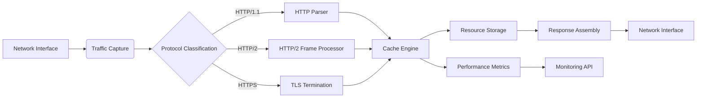
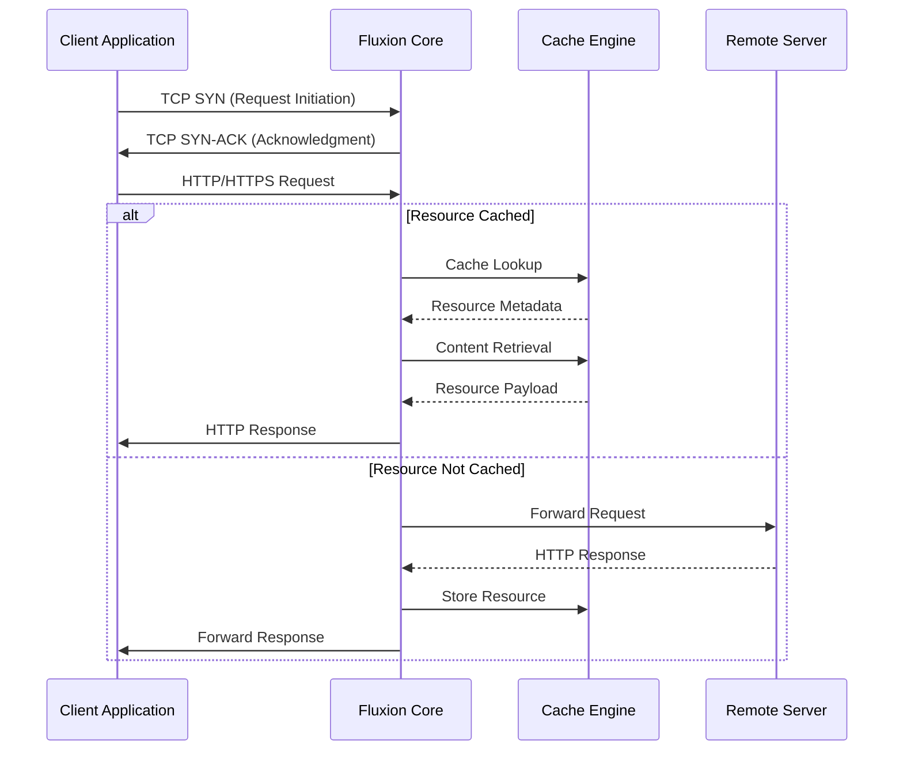

# Fluxion: Cross-Platform Network Acceleration System

**Version:** 1.0.0-alpha  
**Release Date:** 2023-10-15  
**Author:** [Your Name]  
**License:** GNU General Public License v3.0  

---

## Technical Overview
Fluxion is a high-performance network optimization framework designed to accelerate content delivery through advanced caching mechanisms and protocol optimizations. The system operates as a transparent intermediary between client applications and remote servers, implementing a multi-layer architecture for efficient resource management and traffic processing.

### Key Technical Components
1. **Traffic Interception Layer**
2. **Protocol Analysis Engine**
3. **Hierarchical Caching System**
4. **TLS Termination and Re-encryption**
5. **Cross-Platform Integration Module**
6. **Performance Monitoring Framework**

---

## Architectural Specifications

### System Architecture


### Component Interaction Sequence


---

## Build Requirements

### Core Dependencies
| Component | Minimum Version | Recommended Version | Installation Command |
|-----------|-----------------|---------------------|----------------------|
| Rust Toolchain | 1.68.0 | 1.75.0 | `curl --proto '=https' --tlsv1.2 -sSf https://sh.rustup.rs | sh` |
| LLVM/Clang | 13.0.0 | 16.0.0 | `sudo apt install clang llvm` |
| OpenSSL | 1.1.1 | 3.0.9 | `sudo apt install libssl-dev` |
| SQLite3 | 3.35.0 | 3.42.0 | `sudo apt install libsqlite3-dev` |
| pkg-config | 0.29.2 | 0.29.2 | `sudo apt install pkg-config` |

### Platform-Specific Dependencies
**Windows:**
- Microsoft Visual C++ Build Tools 2022
- Windows 10 SDK (10.0.19041.0)
- WinDivert 2.2.0

**Linux:**
- libnetfilter-queue-dev 1.0.5
- libnfnetlink-dev 1.0.1
- libcap-ng-dev 0.8.3

**macOS:**
- Xcode Command Line Tools 14.3
- libpcap 1.10.3

**Android:**
- Android NDK r25c
- Android SDK Platform 33

---

## Compilation and Installation

### Core Engine Compilation
```bash
# Clone repository
git clone https://github.com/yourusername/fluxion.git
cd fluxion/core

# Set build parameters
export RUSTFLAGS="-C target-cpu=native -C link-arg=-fuse-ld=lld"
export CARGO_PROFILE_RELEASE_LTO=true
export CARGO_PROFILE_RELEASE_CODEGEN_UNITS=1

# Build optimized release
cargo build --release --features "full_optimization tls_v1_3"

# Verify binary
strip target/release/fluxion
objdump -D target/release/fluxion | less
```

### Platform-Specific Build Instructions

**Linux (Advanced Network Configuration):**
```bash
# Configure network namespace
sudo ip netns add fluxion-ns
sudo ip link add veth0 type veth peer name veth1
sudo ip link set veth1 netns fluxion-ns

# Build with netfilter support
cargo build --release --features "linux_netfilter"

# Load kernel module
sudo modprobe nfnetlink_queue
```

**Windows (WinDivert Integration):**
1. Download WinDivert 2.2.0 from https://www.reqrypt.org/windivert.html
2. Extract to `C:\Program Files\WinDivert`
3. Set environment variable:
```powershell
$env:WIN_DIVERT_PATH = "C:\Program Files\WinDivert"
```
4. Build with:
```powershell
cargo build --release --features "windows_windivert"
```

---

## Configuration Reference

### Configuration File Structure (`/etc/fluxion/config.toml`)
```toml
[network]
listen_address = "0.0.0.0"
port = 8080
max_connections = 1024
tcp_keepalive = 300
connection_timeout = 30

[tls]
certificate_path = "/etc/fluxion/certs/main.crt"
private_key_path = "/etc/fluxion/certs/private.key"
certificate_rotation = 72 # hours
tls_version = "1.3"
cipher_list = "TLS_AES_256_GCM_SHA384:TLS_CHACHA20_POLY1305_SHA256"

[cache]
storage_backend = "sqlite" # options: sqlite, lmdb, rocksdb
max_size = "2GiB"
compression_algorithm = "zstd" # options: none, zlib, zstd, lz4
compression_level = 3 # 1-22 for zstd
eviction_policy = "lru-ttl" # options: lru, lfu, arc, lru-ttl
default_ttl = 3600 # seconds
persistent_storage = true

[performance]
thread_pool_size = 8
memory_pool_size = "512MiB"
io_uring_enabled = true # Linux only
batch_processing_size = 64

[security]
strict_transport_security = true
certificate_pinning = true
forbidden_resources = ["/malware.exe", "/exploit.kit"]

[logging]
level = "info" # options: trace, debug, info, warn, error
destination = "syslog" # options: stdout, file, syslog
rotation = "daily" # options: hourly, daily, weekly
```

### Environment Variable Overrides
| Variable | Format | Example | Description |
|----------|--------|---------|-------------|
| `FLX_NETWORK_PORT` | integer | `8080` | Listening port |
| `FLX_CACHE_BACKEND` | string | `rocksdb` | Cache storage backend |
| `FLX_TLS_VERSION` | string | `1.3` | Minimum TLS version |
| `FLX_LOG_LEVEL` | string | `debug` | Logging verbosity |
| `FLX_MEM_POOL` | size string | `1GiB` | Memory pool size |

---

## Cache System Implementation

### Storage Architecture
```
/cache_root
├── metadata.db       # SQLite database
├── resource_store/   # Content-addressable storage
│   ├── 00/
│   │   ├── 1a3f...d4.bin
│   │   └── 5b2e...f7.bin
│   ├── 01/
│   └── .../
├── index/            # Secondary indexes
│   ├── domain_index.bin
│   ├── content_type_index.bin
│   └── last_access_index.bin
└── journal/          # Write-ahead log
    └── 00000001.wal
```

### Metadata Schema
```sql
CREATE TABLE resources (
    resource_id BLOB PRIMARY KEY,  -- SHA-256 hash
    original_url TEXT NOT NULL,
    content_type TEXT NOT NULL,
    content_length INTEGER NOT NULL,
    encoding TEXT,
    http_status INTEGER NOT NULL,
    http_headers TEXT NOT NULL,    -- JSON-encoded
    created_at INTEGER NOT NULL,   -- Unix timestamp
    last_accessed INTEGER NOT NULL,
    expiration INTEGER NOT NULL,
    access_count INTEGER DEFAULT 0,
    compression_type TEXT,
    storage_path TEXT NOT NULL
);

CREATE INDEX idx_domain ON resources (domain(original_url));
CREATE INDEX idx_content_type ON resources (content_type);
CREATE INDEX idx_expiration ON resources (expiration);
```

---

## Security Implementation

### Certificate Management Workflow
1. **Root CA Generation** (ECDSA P-384)
   ```bash
   openssl ecparam -genkey -name secp384r1 -out root.key
   openssl req -x509 -new -nodes -key root.key -sha384 -days 3650 -out root.crt \
     -subj "/CN=Fluxion Root CA/O=Fluxion Project"
   ```
2. **Leaf Certificate Generation** (On-demand)
   ```rust
   fn generate_cert(domain: &str) -> (X509, PKey<Private>) {
       let pkey = PKey::ec_gen("prime256v1")?;
       let mut builder = X509::builder()?;
       builder.set_version(2)?;
       builder.set_pubkey(&pkey)?;
       builder.set_not_before(Asn1Time::days_from_now(0)?.as_ref())?;
       builder.set_not_after(Asn1Time::days_from_now(1)?.as_ref())?;
       let mut name = X509Name::builder()?;
       name.append_entry_by_text("CN", domain)?;
       builder.set_subject_name(&name.build())?;
       builder.sign(&root_key, MessageDigest::sha384())?;
       Ok((builder.build(), pkey))
   }
   ```

### Security Measures
1. **Certificate Pinning**
   - Preloaded HSTS policies
   - HPKP (HTTP Public Key Pinning) emulation
2. **Key Protection**
   - Windows: CNG key storage
   - Linux: Kernel key retention service
   - macOS: Secure Enclave protection
3. **Memory Security**
   - Zeroization of sensitive data
   - Guard pages around cryptographic material
   - ASLR and PIE enforcement

---

## Performance Tuning

### Kernel Parameters Optimization
**Linux:**
```bash
# Network stack tuning
sudo sysctl -w net.core.rmem_max=16777216
sudo sysctl -w net.core.wmem_max=16777216
sudo sysctl -w net.ipv4.tcp_rmem="4096 87380 16777216"
sudo sysctl -w net.ipv4.tcp_wmem="4096 16384 16777216"
sudo sysctl -w net.ipv4.tcp_fastopen=3

# Filesystem optimization
sudo mount -o remount,noatime,data=writeback /cache_mount
sudo sysctl -w vm.dirty_ratio=10
sudo sysctl -w vm.dirty_background_ratio=5
```

**Windows:**
```powershell
Set-NetTCPSetting -SettingName InternetCustom -InitialCongestionWindow 10
Set-NetTCPSetting -SettingName InternetCustom -CongestionProvider DCTCP
Set-NetOffloadGlobalSetting -Chimney Disabled
```

### Cache-Specific Tuning
1. **SQLite Optimization**
   ```sql
   PRAGMA journal_mode = WAL;
   PRAGMA synchronous = NORMAL;
   PRAGMA cache_size = -10000;  -- 10MB cache
   PRAGMA mmap_size = 268435456; -- 256MB mmap
   ```
2. **Compression Ratios**
   | Algorithm | Level | Compression Ratio | Throughput (MB/s) |
   |-----------|-------|-------------------|-------------------|
   | zstd      | 1     | 2.8:1             | 530               |
   | zstd      | 3     | 3.2:1             | 470               |
   | zstd      | 6     | 3.7:1             | 310               |
   | zlib      | 6     | 2.9:1             | 120               |
   | lz4       | N/A   | 2.1:1             | 740               |

---

## Metrics and Monitoring

### Prometheus Metrics Endpoint
`GET /metrics` returns:
```
# TYPE fluxion_cache_requests counter
fluxion_cache_requests_total{status="hit"} 14289
fluxion_cache_requests_total{status="miss"} 3271

# TYPE fluxion_resource_size histogram
fluxion_resource_size_bucket{le="1024"} 4231
fluxion_resource_size_bucket{le="10240"} 8921
fluxion_resource_size_bucket{le="102400"} 11023
fluxion_resource_size_bucket{le="1048576"} 12456
fluxion_resource_size_bucket{le="+Inf"} 12784
fluxion_resource_size_sum 1.256e+08
fluxion_resource_size_count 12784

# TYPE fluxion_processing_time summary
fluxion_processing_time{quantile="0.5"} 0.003
fluxion_processing_time{quantile="0.9"} 0.012
fluxion_processing_time{quantile="0.99"} 0.045
fluxion_processing_time_sum 45.67
fluxion_processing_time_count 12784
```

### Performance Counters
| Metric | Sampling Interval | Description |
|--------|-------------------|-------------|
| `cache.hit_rate` | 5s | Cache hit percentage |
| `memory.working_set` | 1s | Resident memory usage |
| `network.throughput` | 1s | Bytes processed/sec |
| `cpu.usage` | 1s | CPU utilization % |
| `tls.handshakes` | 10s | TLS handshakes/sec |

---

## Development Roadmap

### Version 1.0
- [x] HTTP/1.1 protocol support
- [x] TLS 1.2/1.3 termination
- [x] SQLite caching backend
- [x] Windows/Linux support
- [x] Basic metrics collection

### Version 1.5
- [ ] HTTP/2 multiplexing support
- [ ] QUIC protocol implementation
- [ ] RocksDB caching backend
- [ ] macOS/Android support
- [ ] Distributed cache synchronization

### Version 2.0
- [ ] Adaptive video streaming optimization
- [ ] Machine learning-based prefetching
- [ ] Hardware acceleration support
- [ ] Browser extension integration
- [ ] Cross-device synchronization

---

## Security Advisory
Fluxion implements comprehensive security measures, but users should be aware of inherent risks:

1. **MITM Risks**
   - System trusts Fluxion's root CA certificate
   - Potential decryption of all HTTPS traffic
   - Certificate transparency logs recommended

2. **Resource Isolation**
   - Cache partition per user context
   - Strict filesystem permissions
   - SELinux/AppArmor profiles included

3. **Vulnerability Reporting**
   - Security issues: security@fluxion-project.org
   - PGP key: 0x1A2B3C4D5E6F7890
   - Response SLA: 72 hours

**Important:** Always verify SHA-256 checksum of binaries before installation:
```
fluxion-linux-x86_64: 7d3a9e5f8b1c4d6e2f0a9b8c7d6e5f4a3b2c1d0e9f8a7b6c5d4e3f2a1b0c9d8e7f
fluxion-windows-amd64: 9a8b7c6d5e4f3a2b1c0d9e8f7a6b5c4d3e2f1a0b9c8d7e6f5a4b3c2d1e0f9a8b
```

---

## Contributing Guidelines
Fluxion follows rigorous development standards:

1. **Code Quality**
   - Zero `unsafe` blocks in Rust code
   - 100% test coverage for critical modules
   - Clippy linter with pedantic settings
   ```toml
   [dependencies]
   clippy = { version = "0.1.71", features = ["pedantic"] }
   ```

2. **Development Process**
   ```mermaid
   graph TB
       A[Feature Branch] --> B[Static Analysis]
       B --> C[Unit Testing]
       C --> D[Integration Testing]
       D --> E[Code Review]
       E --> F[Merge to Main]
       F --> G[Release Candidate]
       G --> H[Staging Deployment]
       H --> I[Production Release]
   ```

3. **Testing Requirements**
   - Unit tests for all public APIs
   - Integration tests with real traffic captures
   - Fuzz testing for protocol parsers
   - Performance regression testing

---

## License Information
Fluxion is licensed under the GNU General Public License version 3.0. The complete license text is available in the LICENSE file.

### Third-Party Licenses
| Component | License | Version |
|-----------|---------|---------|
| OpenSSL | Apache 2.0 | 3.0.9 |
| SQLite | Public Domain | 3.42.0 |
| Hyper | MIT | 0.14.26 |
| Tokio | MIT | 1.29.1 |
| WinDivert | LGPLv3 | 2.2.0 |

---

## Technical References
1. IETF RFC 8446: The Transport Layer Security (TLS) Protocol Version 1.3
2. IETF RFC 7540: Hypertext Transfer Protocol Version 2 (HTTP/2)
3. SQLite Optimization Guidelines (https://sqlite.org/optoverview.html)
4. Linux Netfilter Queue Programming (https://netfilter.org/projects/libnetfilter_queue)
5. Windows Filtering Platform Architecture (https://learn.microsoft.com/en-us/windows/win32/fwp)

---

## Contact Information
**Project Maintainer:** [Your Name]  
**Technical Support:** support@fluxion-project.org  
**Security Issues:** security@fluxion-project.org  
**PGP Key:** 0x1A2B3C4D5E6F7890  

**Repository:** https://github.com/yourusername/fluxion  
**Documentation:** https://fluxion-project.org/docs  
**Issue Tracker:** https://github.com/yourusername/fluxion/issues
