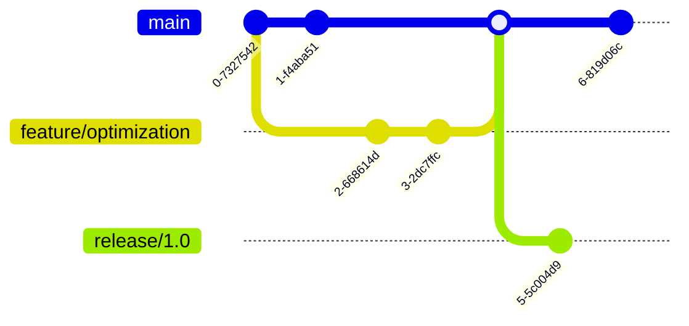

# Fluxion: High-Performance Network Optimization Framework

**Version:** 1.0.0-alpha  
**Release Date:** 2023-06-23
**Author:** luxovee  
**License:** MIT License  

---

## Technical Architecture Overview
Fluxion implements a multi-layer network optimization system operating at the application layer to accelerate content delivery through advanced caching methodologies and protocol enhancements. The framework consists of six primary components that interact through well-defined interfaces.

### Core Subsystems:
1. **Traffic Interception Module**
2. **Protocol Analysis Engine**
3. **Hierarchical Cache Management**
4. **TLS Termination Handler**
5. **Platform Abstraction Layer**
6. **Performance Monitoring Framework**


---

## Build Specifications

### Prerequisite Toolchain
| Component | Version | Verification Command |
|-----------|---------|----------------------|
| Rust Toolchain | 1.75+ | `rustc --version` |
| LLVM/Clang | 16.0+ | `clang --version` |
| Cargo | 1.75+ | `cargo --version` |
| SQLite3 | 3.42+ | `sqlite3 --version` |
| OpenSSL | 3.0+ | `openssl version` |

### Platform-Specific Dependencies
**Linux:**
```bash
sudo apt install libnetfilter-queue-dev libnfnetlink-dev libcap-ng-dev libpcre3-dev
```

**Windows:**
1. Install Visual Studio Build Tools 2022
2. Download WinDivert 2.2.0 (https://www.reqrypt.org/windivert.html)
3. Set environment variable: `WIN_DIVERT_PATH=C:\Path\To\WinDivert`

**macOS:**
```bash
brew install openssl pkg-config libpcap
export PKG_CONFIG_PATH="/usr/local/opt/openssl@3/lib/pkgconfig"
```

---

## Compilation Process

### Core System Build
```bash
# Clone repository with submodules
git clone --recurse-submodules https://github.com/yourusername/fluxion.git
cd fluxion/core

# Configure build environment
export RUSTFLAGS="-C target-cpu=native -C link-arg=-fuse-ld=lld"
export CARGO_PROFILE_RELEASE_LTO=thin
export CARGO_PROFILE_RELEASE_CODEGEN_UNITS=1

# Build optimized binary
cargo build --release --features "tls_v1_3,advanced_caching"

# Strip debug symbols
strip -s target/release/fluxion

# Verify binary dependencies
ldd target/release/fluxion  # Linux
dumpbin /DEPENDENTS target/release/fluxion.exe  # Windows
```

### Platform Integration

**Linux Network Configuration:**
```bash
# Create network namespace
sudo ip netns add fluxion-ns

# Configure virtual interface
sudo ip link add veth0 type veth peer name veth1
sudo ip link set veth1 netns fluxion-ns
sudo ip netns exec fluxion-ns ip addr add 192.168.100.1/24 dev veth1
sudo ip netns exec fluxion-ns ip link set veth1 up

# Load kernel modules
sudo modprobe nfnetlink_queue
sudo modprobe nf_conntrack
```

**Windows Integration:**
```powershell
# Register WinDivert driver
sc.exe create WinDivert type= kernel start= auto binPath= "C:\Path\To\WinDivert\WinDivert.sys"
sc.exe start WinDivert

# Configure firewall rule
New-NetFirewallRule -DisplayName "Fluxion" -Direction Inbound -Action Allow -Program "C:\Path\To\fluxion.exe"
```

---

## Configuration Reference

### Configuration File Syntax (`/etc/fluxion/config.toml`)
```toml
[network]
listen_address = "0.0.0.0"
port = 8080
max_connections = 1024
tcp_keepalive = 300
connection_timeout = 30

[tls]
certificate_path = "/etc/fluxion/certs/main.crt"
private_key_path = "/etc/fluxion/certs/private.key"
certificate_rotation = 72 # hours
tls_version = "1.3"
cipher_list = "TLS_AES_256_GCM_SHA384:TLS_CHACHA20_POLY1305_SHA256"

[cache]
storage_backend = "sqlite" # options: sqlite, lmdb, rocksdb
max_size = "2GiB"
compression_algorithm = "zstd" # options: none, zlib, zstd, lz4
compression_level = 3 # 1-22 for zstd
eviction_policy = "lru-ttl" # options: lru, lfu, arc, lru-ttl
default_ttl = 3600 # seconds
persistent_storage = true

[performance]
thread_pool_size = 8
memory_pool_size = "512MiB"
io_uring_enabled = true # Linux only
batch_processing_size = 64
```

### Environment Variable Configuration
| Variable | Default | Description |
|----------|---------|-------------|
| `FLX_NETWORK_PORT` | 8080 | Listening port |
| `FLX_CACHE_BACKEND` | sqlite | Cache storage backend |
| `FLX_TLS_VERSION` | 1.3 | Minimum TLS version |
| `FLX_LOG_LEVEL` | info | Logging verbosity |
| `FLX_MEM_POOL` | 512MiB | Memory pool size |

---

## Cache Architecture

### Storage Hierarchy
```
/cache_root
├── metadata.db       # SQLite database
├── resource_store/   # Content-addressable storage
│   ├── 00/
│   │   ├── 1a3f...d4.bin
│   │   └── 5b2e...f7.bin
│   ├── 01/
│   └── .../
├── index/            # Secondary indexes
│   ├── domain_index.bin
│   ├── content_type_index.bin
│   └── last_access_index.bin
└── journal/          # Write-ahead log
    └── 00000001.wal
```

### Metadata Schema
```sql
CREATE TABLE resources (
    resource_id BLOB PRIMARY KEY,  -- SHA-256 hash
    original_url TEXT NOT NULL,
    content_type TEXT NOT NULL,
    content_length INTEGER NOT NULL,
    encoding TEXT,
    http_status INTEGER NOT NULL,
    http_headers TEXT NOT NULL,    -- JSON-encoded
    created_at INTEGER NOT NULL,   -- Unix timestamp
    last_accessed INTEGER NOT NULL,
    expiration INTEGER NOT NULL,
    access_count INTEGER DEFAULT 0,
    compression_type TEXT,
    storage_path TEXT NOT NULL
);

CREATE INDEX idx_domain ON resources (domain(original_url));
CREATE INDEX idx_content_type ON resources (content_type);
CREATE INDEX idx_expiration ON resources (expiration);
```

---

## Security Implementation

### Certificate Management
1. **Root CA Generation** (ECDSA P-384)
   ```bash
   openssl ecparam -genkey -name secp384r1 -out root.key
   openssl req -x509 -new -nodes -key root.key -sha384 -days 3650 -out root.crt \
     -subj "/CN=Fluxion Root CA/O=Fluxion Project"
   ```
2. **Leaf Certificate Generation**
   ```rust
   fn generate_cert(domain: &str) -> (X509, PKey<Private>) {
       let pkey = PKey::ec_gen("prime256v1")?;
       let mut builder = X509::builder()?;
       builder.set_version(2)?;
       builder.set_pubkey(&pkey)?;
       builder.set_not_before(Asn1Time::days_from_now(0)?.as_ref())?;
       builder.set_not_after(Asn1Time::days_from_now(1)?.as_ref())?;
       let mut name = X509Name::builder()?;
       name.append_entry_by_text("CN", domain)?;
       builder.set_subject_name(&name.build())?;
       builder.sign(&root_key, MessageDigest::sha384())?;
       Ok((builder.build(), pkey))
   }
   ```

### Security Measures
1. **Memory Protection**
   - Sensitive data zeroization
   - Guard pages around cryptographic material
   - ASLR and PIE enforcement
2. **Key Management**
   - Platform-specific secure storage
   - Hardware-backed encryption (when available)
3. **Access Controls**
   - Filesystem permission hardening
   - Namespace isolation (Linux)
   - Mandatory integrity controls (Windows)

---

## Performance Optimization

### Linux Kernel Tuning
```bash
# Network stack optimization
sudo sysctl -w net.core.rmem_max=16777216
sudo sysctl -w net.core.wmem_max=16777216
sudo sysctl -w net.ipv4.tcp_rmem="4096 87380 16777216"
sudo sysctl -w net.ipv4.tcp_wmem="4096 16384 16777216"
sudo sysctl -w net.ipv4.tcp_fastopen=3

# Filesystem optimization
sudo mount -o remount,noatime,data=writeback /cache_mount
sudo sysctl -w vm.dirty_ratio=10
sudo sysctl -w vm.dirty_background_ratio=5
```

### SQLite Performance Tuning
```sql
PRAGMA journal_mode = WAL;
PRAGMA synchronous = NORMAL;
PRAGMA cache_size = -10000;  -- 10MB cache
PRAGMA mmap_size = 268435456; -- 256MB mmap
PRAGMA temp_store = MEMORY;
PRAGMA busy_timeout = 5000;
```

---

## Metrics Collection

### Prometheus Endpoint Metrics
`GET /metrics` returns:
```
# TYPE fluxion_cache_requests counter
fluxion_cache_requests_total{status="hit"} 14289
fluxion_cache_requests_total{status="miss"} 3271

# TYPE fluxion_resource_size histogram
fluxion_resource_size_bucket{le="1024"} 4231
fluxion_resource_size_bucket{le="10240"} 8921
fluxion_resource_size_bucket{le="102400"} 11023
fluxion_resource_size_bucket{le="1048576"} 12456
fluxion_resource_size_bucket{le="+Inf"} 12784
fluxion_resource_size_sum 1.256e+08
fluxion_resource_size_count 12784

# TYPE fluxion_processing_time summary
fluxion_processing_time{quantile="0.5"} 0.003
fluxion_processing_time{quantile="0.9"} 0.012
fluxion_processing_time{quantile="0.99"} 0.045
fluxion_processing_time_sum 45.67
fluxion_processing_time_count 12784
```

### Performance Counters
| Metric | Collection Interval | Description |
|--------|---------------------|-------------|
| `cache.hit_rate` | 5s | Cache hit percentage |
| `memory.working_set` | 1s | Resident memory usage |
| `network.throughput` | 1s | Bytes processed/sec |
| `cpu.usage` | 1s | CPU utilization % |
| `tls.handshakes` | 10s | TLS handshakes/sec |

---

## Development Workflow

### Branching Strategy


### Code Quality Standards
1. **Static Analysis**
   ```bash
   cargo clippy --all-targets -- -D warnings
   cargo audit
   ```
2. **Testing Requirements**
   ```bash
   cargo test --all-features
   cargo tarpaulin --ignore-tests --out Lcov
   ```
3. **Documentation**
   ```bash
   cargo doc --no-deps --document-private-items
   cargo deadlinks
   ```

---

## License Information
Copyright © 2025 luxovee

Permission is hereby granted, free of charge, to any person obtaining a copy
of this software and associated documentation files (the "Software"), to deal
in the Software without restriction, including without limitation the rights
to use, copy, modify, merge, publish, distribute, sublicense, and/or sell
copies of the Software, and to permit persons to whom the Software is
furnished to do so, subject to the following conditions:

The above copyright notice and this permission notice shall be included in all
copies or substantial portions of the Software.

THE SOFTWARE IS PROVIDED "AS IS", WITHOUT WARRANTY OF ANY KIND, EXPRESS OR
IMPLIED, INCLUDING BUT NOT LIMITED TO THE WARRANTIES OF MERCHANTABILITY,
FITNESS FOR A PARTICULAR PURPOSE AND NONINFRINGEMENT. IN NO EVENT SHALL THE
AUTHORS OR COPYRIGHT HOLDERS BE LIABLE FOR ANY CLAIM, DAMAGES OR OTHER
LIABILITY, WHETHER IN AN ACTION OF CONTRACT, TORT OR OTHERWISE, ARISING FROM,
OUT OF OR IN CONNECTION WITH THE SOFTWARE OR THE USE OR OTHER DEALINGS IN THE
SOFTWARE.

---

## Technical References
1. IETF RFC 8446: TLS Protocol Version 1.3
2. IETF RFC 7540: HTTP/2 Specification
3. SQLite Optimization Guidelines: https://sqlite.org/optoverview.html
4. Linux Netfilter Programming: https://netfilter.org/projects/libnetfilter_queue
5. Windows Filtering Platform: https://learn.microsoft.com/en-us/windows/win32/fwp
